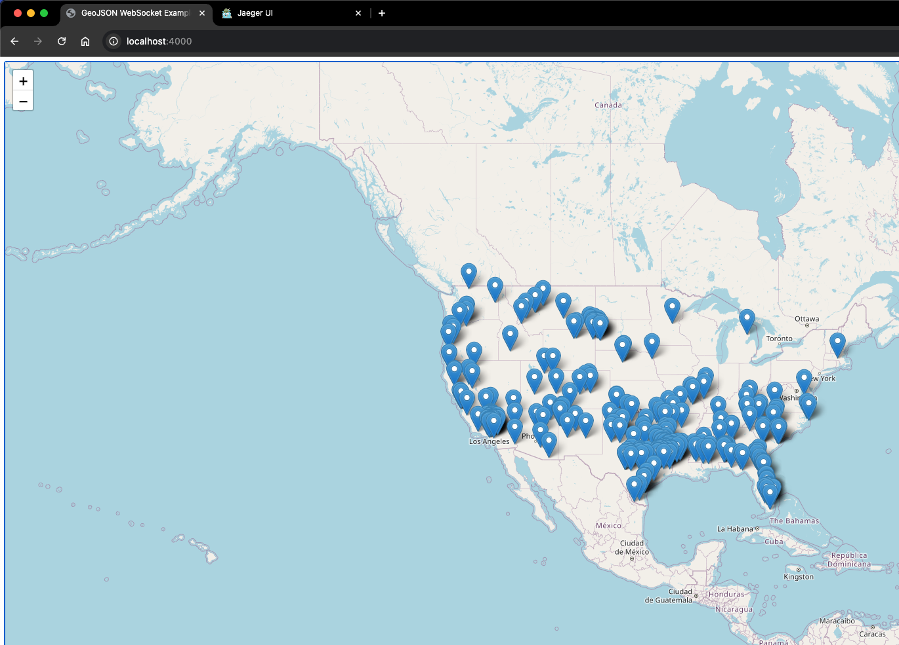
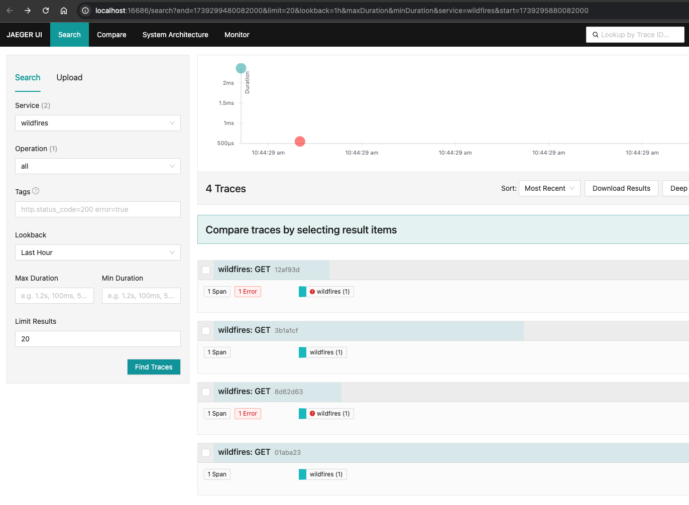

# Wildfires

## Building / Testing

Setup commands:

```
# Start dependency services
docker compose up --detach \
  --remove-orphans \
  --renew-anon-volumes \
  --force-recreate \
  postgres otel jaeger

# Build
mix deps.get
mix compile
mix ecto.create

# Debugging/Testing
iex -S mix
# or
iex -S mix run --no-start

# Run tests
MIX_ENV=test mix ecto.create 
mix test
```

Once your server is running, you can view the app at: http://localhost:4000/

## Deploying 

```
# Run entire stack in container
docker compose up --detach \
  --remove-orphans \
  --renew-anon-volumes \
  --force-recreate \
  --build
```

You can still view the app at: http://localhost:4000/

Once running the entire docker stack (which uses `MIX_ENV=prod`), you'll also be able to see Jaeger telemetry here: http://localhost:16686/search

If I'm running the app (it's on most of the day), you can also see it at: https://wildfires.nezteb.net/

## Screenshots

The app:



Jaeger:



### Links

- https://www.arcgis.com/home/item.html?id=d957997ccee7408287a963600a77f61f
- https://services9.arcgis.com/RHVPKKiFTONKtxq3/arcgis/rest/services/USA_Wildfires_v1/FeatureServer
- https://developers.arcgis.com/rest/services-reference/enterprise/query-feature-service/
- https://hex.pm/packages/bandit
- https://epsg.io/4326

### TODO

- [?] Perimeter data
- [X] Packaging and deployment plan
- [X] Telemetry/Monitoring of workload
- [X] UI to visualize current fires
- [X] Unit/Integration tests
